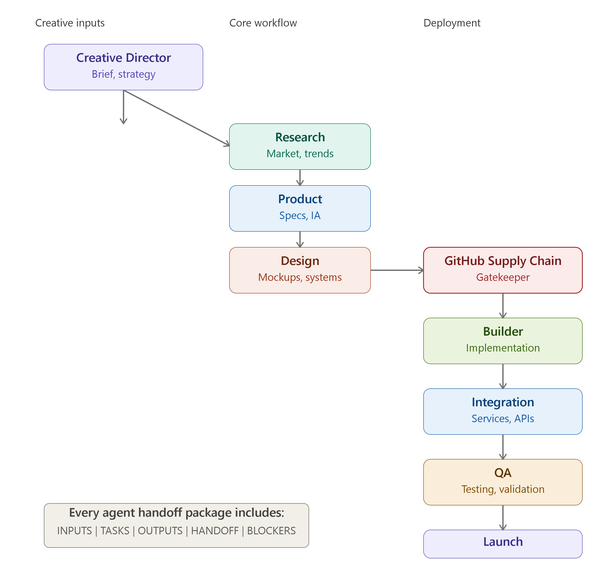

# Multi-Agent Deterministic Handoff System

**Owner**: @Malphite10

A production-grade multi-agent orchestration framework with deterministic handoffs and a critical supply-chain gatekeeper.

## Quick Start

```bash
git clone https://github.com/@Malphite10/multi-agent-system.git
cd multi-agent-system
npm install
```

## Architecture

This system implements a deterministic handoff structure (INPUTS/TASKS/OUTPUTS/HANDOFF/BLOCKERS) across 11 specialized agents.



## Critical Gatekeeper: GitHub Supply Chain Agent

Prevents:
- ❌ Unknown dependencies
- ❌ Security vulnerabilities
- ❌ License conflicts
- ❌ Supply-chain attacks

## Repository Structure

- `agents/`: Agent specifications and skills.
- `design-system/registry/`: Core UI components with performance scores.
- `mistral-agent/`: Mistral Cloud Agent for large-scale inference.
- `release/`: Marketplace submission and preview rules.
- `templates/`: DNA library for various template types.

## Success Metrics

- ✓ Zero supply-chain incidents.
- ✓ Deterministic deployment.
- ✓ 100% Audit traceability.

---

Built with ❤️ by @Malphite10

 🙌 🐱
